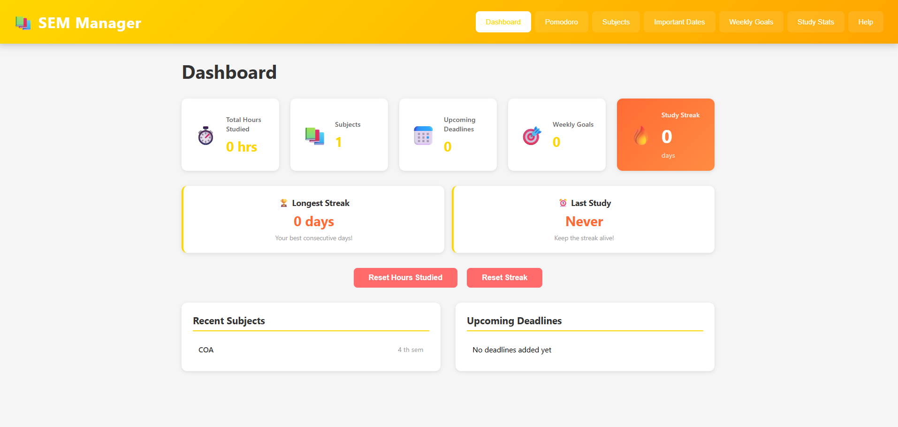
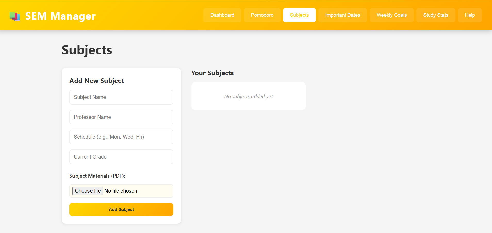
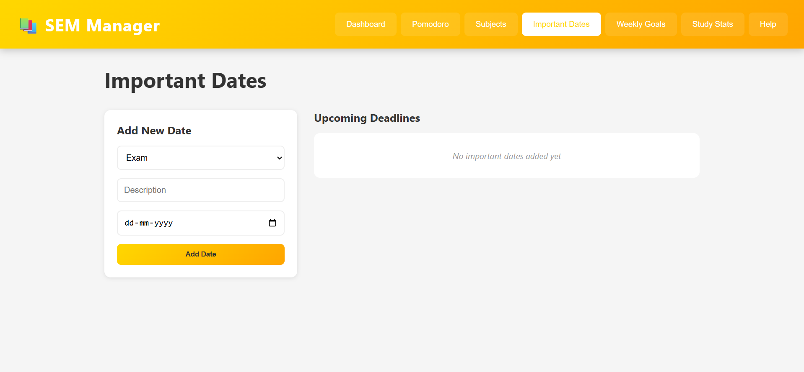
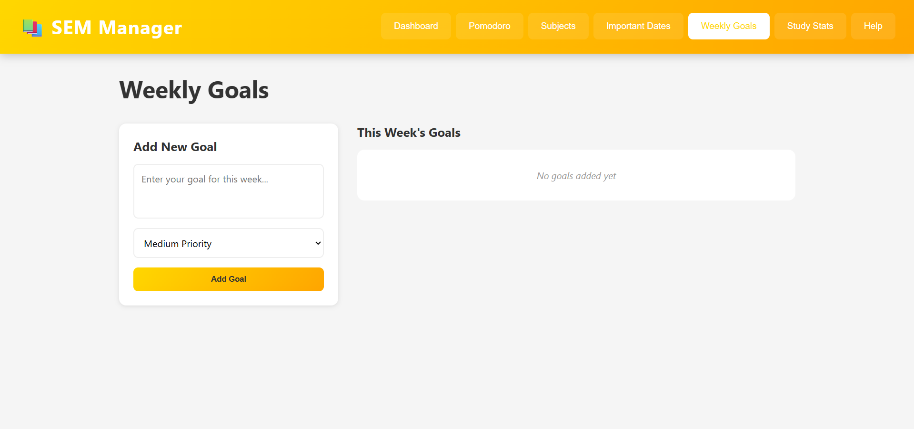
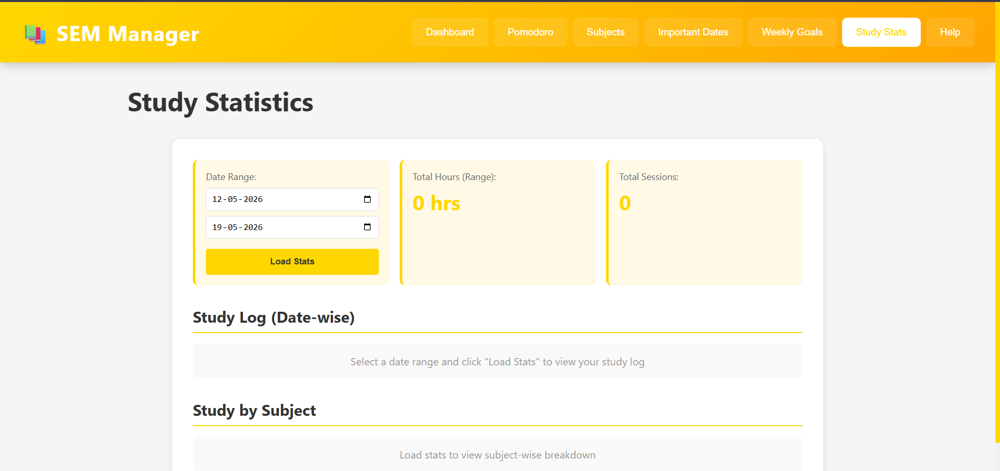
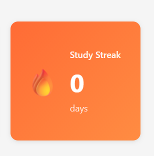

# 📚 Semester Manager 2.0

A modern, feature-rich **semester management application** built with vanilla HTML, CSS, and JavaScript. Manage your courses, track study hours, set goals, and maintain a study streak—all in one beautiful app!

## 🌟 Features

### ✅ Core Features
- 📊 **Dashboard** - Quick overview of all your metrics at a glance
- ⏱️ **Pomodoro Timer** - 25-minute focus sessions with 5-minute breaks
- 📚 **Subject Management** - Track courses with professor info, schedules, and grades
- 📄 **PDF Storage** - Upload and manage course materials for each subject
- 📅 **Important Dates** - Never miss a deadline with organized deadline tracking
- 🎯 **Weekly Goals** - Set and track weekly academic goals with priority levels
- 📊 **Study Statistics** - Analyze your study patterns with date-wise and subject-wise reports
- 🔥 **Study Streak** - Gamified streak system to keep you motivated
- 💾 **Data Persistence** - All data stored locally with IndexedDB

### 🎨 Design Highlights
- **Yellow/Orange Gradient Theme** - Beautiful, modern color scheme
- **Responsive Design** - Works perfectly on desktop, tablet, and mobile
- **Smooth Animations** - Polished UI with transitions and hover effects
- **User-Friendly Interface** - Intuitive navigation with easy-to-use tabs

---

## 📸 Screenshots & Demo

### Dashboard
*Add screenshot of the main dashboard here*


### Pomodoro Timer
*Add screenshot of the Pomodoro timer in action*


### Subjects Management
*Add screenshot of the subjects tab with PDF upload feature*




### Important Dates
*Add screenshot of the important dates/deadlines section*




### Weekly Goals
*Add screenshot of the weekly goals management*




### Study Statistics
*Add screenshot of the study statistics and analytics*




### Study Streak
*Add screenshot showing the study streak feature*




### 📹 Demo Video
*Add embedded demo video here*
```
[](https://www.youtube.com/watch?v=YOUR_VIDEO_ID)
```

---

## 🚀 Getting Started

### Prerequisites
- Modern web browser (Chrome, Firefox, Safari, Edge)
- No installation required!

### Installation

1. **Clone the repository**
   ```bash
   git clone https://github.com/mtandrita/study-material-manager.git
   cd study-material-manager
   ```

2. **Open in your browser**
   - Simple method: Double-click `index.html`
   - Or use a local server:
     ```bash
     # Python 3
     python -m http.server 8000
     
     # Python 2
     python -m SimpleHTTPServer 8000
     
     # Node.js (if installed)
     npx http-server
     ```
   - Visit `http://localhost:8000` in your browser

---

## 📖 Usage Guide

### 🏠 Dashboard
- **Overview**: See your total hours studied, number of subjects, upcoming deadlines, and weekly goals at a glance
- **Study Streak**: Track your consecutive study days with the 🔥 streak counter
- **Quick Stats**: View your longest streak, last study date, and recent subjects

### ⏱️ Pomodoro Timer
- **Start Session**: Click "Start" to begin a 25-minute focused study session
- **Take a Break**: After completion, take a 5-minute break
- **Track Hours**: Hours are automatically added to your dashboard
- **Reset**: Reset the timer anytime with the "Reset" button

### 📚 Subjects
- **Add Subject**: Enter subject name, professor, schedule, grade, and course materials
- **Upload PDFs**: Add multiple PDFs (lecture notes, syllabi, etc.) to each subject
- **Edit Subject**: Click the edit button to modify subject info or manage PDFs
- **Download PDFs**: Download any saved PDF with one click
- **Delete PDFs**: Remove individual PDFs without affecting the subject

### 📅 Important Dates
- **Add Deadlines**: Create deadlines with type (Exam, Assignment, Project, Quiz, Presentation, Other)
- **Date Tracking**: Set due dates and get organized deadline view
- **Upcoming View**: See all deadlines sorted by date

### 🎯 Weekly Goals
- **Create Goals**: Add goals with three priority levels (High, Medium, Low)
- **Track Progress**: Mark goals as completed
- **Priority System**: Color-coded by priority for quick visual scanning

### 📊 Study Statistics
- **Date Range Filtering**: View statistics for any date range
- **Daily Study Log**: See all study sessions with timestamps and hours
- **Subject Breakdown**: Analyze hours studied per subject
- **Total Hours**: Quick calculation of total hours in selected period

### 🔥 Study Streak
- **Auto-Track**: Automatically tracks consecutive days of studying
- **Flame Icon**: Animated 🔥 emoji shows your current streak
- **Longest Record**: System preserves your longest streak even if you break the current one
- **Reset Option**: Manually reset your streak if needed

---

## 💾 Data Storage

### IndexedDB Database Stores
The app uses browser's IndexedDB for local data persistence:
- **subjects** - Course information
- **materials** - PDF files linked to subjects
- **studySessions** - Date-wise study tracking
- **importantDates** - Deadlines and events
- **weeklyGoals** - Weekly goal tracking
- **streakData** - Study streak information

### Data Privacy
✅ **All data is stored locally on your device**
- No data is sent to external servers
- No accounts or logins required
- Complete privacy guaranteed
- Clear all data anytime from browser storage

---

## 🎨 Color Scheme

The app uses a beautiful **Yellow (#FFD700) and Orange (#FFA500) gradient** theme:
- **Primary Color**: `#FFD700` (Gold)
- **Secondary Color**: `#FFA500` (Orange)
- **Accent Color**: `#ff6b35` (Deep Orange for streaks)
- **Background**: `#f5f5f5` (Light Gray)

---

## 📱 Browser Compatibility

| Browser | Support |
|---------|---------|
| Chrome | ✅ Full |
| Firefox | ✅ Full |
| Safari | ✅ Full |
| Edge | ✅ Full |
| Opera | ✅ Full |
| IE 11 | ⚠️ Limited |

---

## 📁 Project Structure

```
study-material-manager/
├── index.html              # Main HTML file (all tabs in one file)
├── styles.css              # All styling with responsive design
├── app.js                  # Application logic and functions
├── database.js             # IndexedDB database manager
├── .gitignore              # Git ignore file
├── README.md               # This file
└── pomodoro.jsx            # Legacy React component (archived)
```

---

## 🛠️ Technologies Used

- **HTML5** - Semantic markup
- **CSS3** - Grid, Flexbox, Animations, Gradients
- **JavaScript (ES6+)** - Classes, Async/Await, Promises
- **IndexedDB** - Browser database for data persistence
- **LocalStorage** - Additional local storage for quick access

---

## ✨ Key Highlights

### 🎯 Pomodoro Technique
The app implements the proven Pomodoro Technique:
- 25-minute focus sessions
- 5-minute breaks
- Scientifically designed for productivity
- Auto-tracking into total hours

### 📊 Smart Analytics
- Date-wise study tracking
- Subject-wise hour distribution
- Custom date range filtering
- Visual study logs

### 🔥 Gamification
- Study streak system keeps you motivated
- Longest streak record preserved
- Visual feedback with animations
- Motivation badges for achievements

### 🎨 Beautiful UI/UX
- Modern gradient design
- Smooth animations and transitions
- Responsive grid layouts
- Mobile-first approach
- Intuitive tab navigation

---

## 🚀 Future Enhancements

Potential features for future versions:
- [ ] GPA Calculator with weighted grades
- [ ] Export data as PDF/CSV
- [ ] Dark mode toggle
- [ ] Cloud sync across devices
- [ ] Study reminders and notifications
- [ ] Subject performance charts
- [ ] Keyboard shortcuts
- [ ] Study session history
- [ ] Customizable Pomodoro intervals
- [ ] Notes during Pomodoro sessions

---

## 💡 Tips for Best Results

1. **Consistent Use**: Study every day to build your streak
2. **Realistic Hours**: Log only actual focused study time
3. **Regular Breaks**: Use the Pomodoro timer for optimal focus
4. **Update Grades**: Keep subject grades current to track progress
5. **Plan Ahead**: Add deadlines as soon as you know about them
6. **Review Weekly**: Check your dashboard every Sunday for the week ahead
7. **Set Achievable Goals**: Break large tasks into weekly goals

---

## 🐛 Troubleshooting

### Data Not Saving?
- Check browser storage: Settings → Privacy → Clear browsing data should NOT clear "Cookies and other site data" unless you want to reset
- Try refreshing the page
- Ensure IndexedDB is enabled in your browser

### PDF Not Uploading?
- Ensure file is in PDF format
- Check file size (browser storage has limits)
- Try a different PDF if the issue persists

### Streak Not Updating?
- Complete at least one full Pomodoro session
- Ensure you're studying on consecutive days
- Check that time is set correctly on your device

### Responsive Design Issues?
- Clear browser cache (Ctrl+Shift+Del)
- Check viewport settings in developer tools
- Try different browser zoom levels

---

## 📞 Support & Feedback

- **Found a bug?** Create an issue on GitHub
- **Have a suggestion?** Open a discussion
- **Want to contribute?** Submit a pull request!

---

## 📄 License

This project is open source and available under the **MIT License**.

---

## 👨‍💻 Author

**Developed with ❤️ for students everywhere**

---

## 🙏 Acknowledgments

- Inspired by the Pomodoro Technique by Francesco Cirillo
- Built with modern web standards and best practices
- Thanks to all students using this app to improve their productivity!

---

## 📈 Version History

### v2.0 (Current)
- ✨ Complete vanilla JavaScript rewrite
- 🔥 Study streak system
- 📊 Advanced statistics
- 🎨 New yellow/orange gradient theme
- 💾 IndexedDB integration
- 📱 Full responsive design

### v1.0
- Initial React-based version

---

## 🎓 Learn More

- [Pomodoro Technique](https://en.wikipedia.org/wiki/Pomodoro_Technique)
- [IndexedDB Documentation](https://developer.mozilla.org/en-US/docs/Web/API/IndexedDB_API)
- [Web Storage Best Practices](https://web.dev/storage/)

---

**Happy studying! Keep building that 🔥 streak!** 🚀
